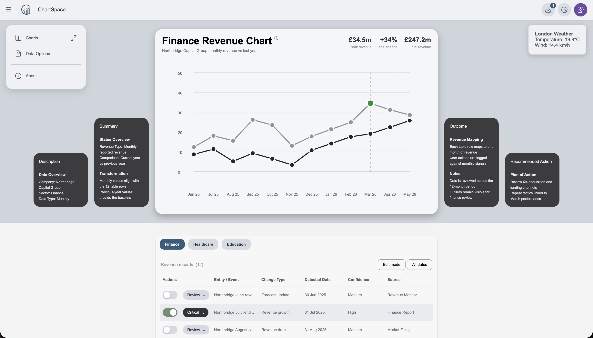
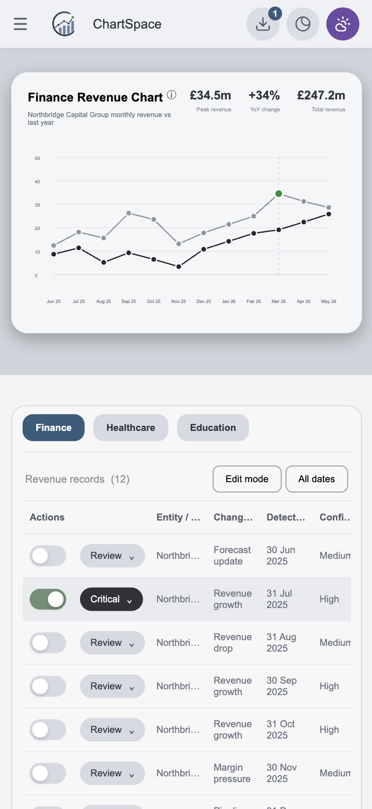

# ChartSpace

[Website Link](https://harvseale-ai.github.io/chartspace-project-2/)

ChartSpace is a single-page JavaScript dashboard for monitoring sector activity across finance, healthcare, and education. It turns monthly event data into a visual chart, contextual side panels, and an interactive table so users can scan trends, review records, and export selected rows.

## User Value

The project is designed for users who need a quick overview of tracked events without moving between reports. It supports fast comparison between sectors, highlights summary metrics, and gives users simple controls for filtering, reviewing, and exporting information.

## Features

- Responsive single-page dashboard built with HTML, CSS, and JavaScript
- Dynamic SVG line chart rendered with JavaScript
- Dataset switching for finance, healthcare, and education
- Interactive event table with selectable rows and editable status labels
- CSV export for selected table rows
- Expandable chart information panels
- Dark and light theme toggle
- Weather popup using the Open-Meteo API
- About modal explaining the purpose of the dashboard
- Mobile, tablet, and desktop responsive layout using Flexbox, Grid, and media queries

## Feature Explanations

| Feature | Explanation |
| --- | --- |
| Revenue chart | Displays a 12-month revenue comparison for the selected sector using two SVG line series. |
| Dataset buttons | Switch the dashboard between finance, healthcare, and education data without reloading the page. |
| Side panels | Show dynamic description, summary, outcome, and recommended action content for the selected dataset. |
| Date range filter | Filters table records by detected date while keeping the selected dataset active. |
| Table actions | Allows users to review records, change status labels, collapse action controls, and export selected rows. |
| Theme toggle | Switches between light and dark mode using JavaScript DOM manipulation. |
| Weather popup | Uses the Open-Meteo API to show a local temperature and wind-speed summary. |

## Technologies

- HTML5
- CSS3
- JavaScript
- SVG
- Open-Meteo API
- Lucide icons

## Project Structure

```text
chartspace-project-2/
├── assets/
│   ├── css/
│   │   ├── chart.css
│   │   └── style.css
│   ├── images/
│   │   ├── chartspace-logo.png
│   │   └── screenshots/
│   │       ├── desktop-dashboard.png
│   │       └── mobile-dashboard.png
│   └── js/
│       ├── app.js
│       └── data.js
├── eslint.config.mjs
├── index.html
├── package-lock.json
├── package.json
└── README.md
```

## How to View Locally

Open `index.html` in a browser.

For a local server, run:

```bash
python3 -m http.server 8000
```

Then visit:

```text
http://localhost:8000
```

## Deployment

Deployment URL: to be added after publishing.

Recommended GitHub Pages deployment steps:

1. Push the latest project files to GitHub.
2. Open the repository on GitHub.
3. Go to `Settings` > `Pages`.
4. Set the source to deploy from the `main` branch.
5. Select the project root folder.
6. Save the settings and wait for GitHub Pages to publish the site.
7. Open the published URL and compare it with the local version.

After deployment, check that the deployed version matches the local version and that the chart, table interactions, theme toggle, weather popup, about modal, and CSV export still work.

## Testing and Validation

Checks completed during development:

- JavaScript passes ESLint with `npm run lint`
- HTML validated with the W3C Validator with no errors
- CSS validated with the Jigsaw CSS Validator with no errors
- Internal links checked with no broken internal links found
- JavaScript syntax checked with `node --check assets/js/app.js`
- Internal image references checked for the logo asset
- Unused `.DS_Store` files removed and ignored with `.gitignore`

[Validator and Test Documentation](https://docs.google.com/document/d/1GLVGgPR4crN_6JHYbnytQOfY64nLtw4a6V7bRIu83Q8/edit?tab=t.0)

## Screenshots

### Desktop Dashboard



### Mobile Dashboard



These screenshots show the main responsive dashboard states used for submission evidence. The desktop screenshot demonstrates the chart/table layout, while the mobile screenshot demonstrates the stacked responsive layout.

## Documentation and Code Quality

- README includes the project description and user value.
- Deployment instructions are provided for GitHub Pages.
- Screenshots and feature explanations are included.
- Wireframes or mockups are optional and are not required for this submission.
- External API and icon sources are attributed in the Credits section.
- HTML, CSS, and JavaScript are separated into external files.
- JavaScript data is separated into `assets/js/data.js`; behaviour lives in `assets/js/app.js`.
- CSS is separated into `assets/css/style.css` and `assets/css/chart.css`.
- Code is organised with beginner-friendly `WHY` comments and named sections.
- File naming and folder structure are consistent across `assets/css`, `assets/js`, and `assets/images`.

## Credits

- Weather data: [Open-Meteo](https://open-meteo.com/)
- Icons: [Lucide](https://lucide.dev/)
- Project built for the WAES Full Stack Bootcamp JavaScript Project 2 submission

## AI Usage and Reflection

AI tools were used to support code review, debugging, project cleanup, documentation planning, and commit organisation.

AI support included:

- Code generation for JavaScript helper functions, chart X and Y axis plotting, date range filtering, and README structure.
- Debugging support for validation errors, Git/GitHub workflow issues, table filtering and Actions to Edit mode errors, and linter warnings.
- Performance and UX optimisation suggestions for responsive layout, chart spacing, table density, side-panel behaviour, and clearer user feedback.
- Reflection and checklist review to compare the project against the WAES submission requirements.

AI helped identify missing checklist items such as README documentation, validation evidence, deployment notes, unused files, and JavaScript separation. It also helped organise the Git history into clearer commits so the project development path is easier to review and improve accessibility controls.

The main benefit was faster feedback on project readiness, code quality, and code refactoring. The main limitation was that AI suggestions still needed complete human review, as they would consistently overcomplicate tasks and create large, unnecessary file edits.
